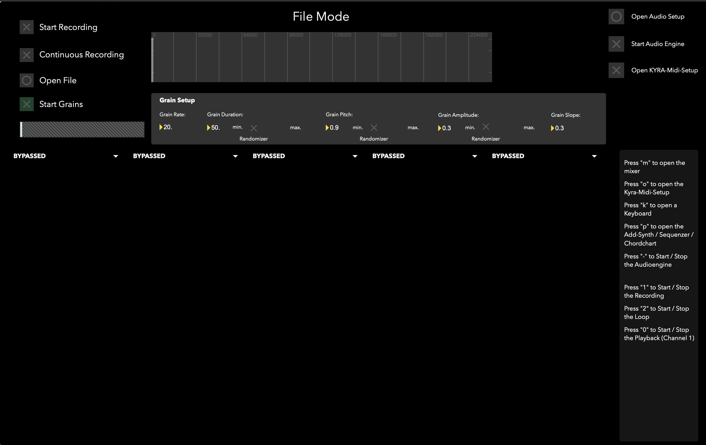
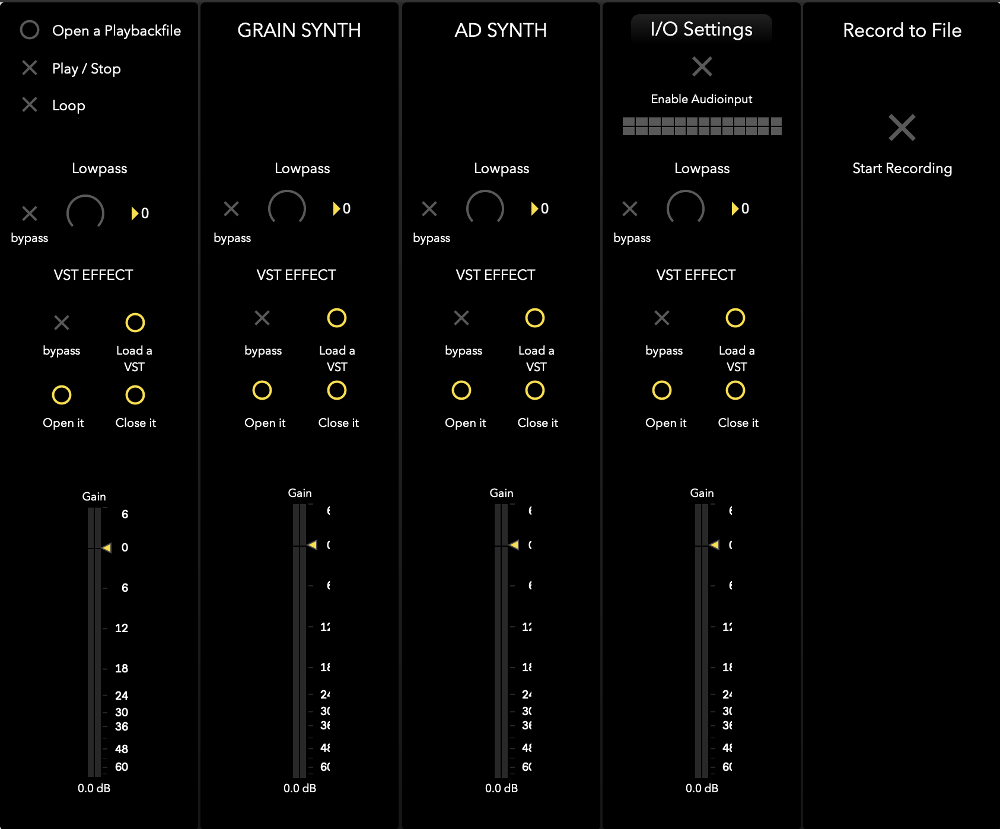

# KYRA
________
A granular Synthesizer (Standalone app) on basis of MaxMSP. 
You can record audio from any source, as source for the granular synthesizer. A small fx Rack, as well as a mixer and some other features are implemented. I'll explain every detail later on. 

You can do whatever you want with it ☺️ have fun ✌🏻

 

### Features
________

- A recorder ;)
- Granular Synthesis "Engine" 😂
- FX-Rack
- Mixer
- Pad-Creation-Machine (or whatever you wanna call it)
  

   

#### Main Window
____

The Main window consists the most important control and a list of shortcuts (on the right side) 

 

#### FX-Rack
_______

 |  |  | |  |  |  | 

| Module | Description |
| ----------- | ----------- |
| Midipitcher | It will pitch the signal to the tone the keyboard is pressing. There are a few controls to adjust the sound a bit ✌🏻 |
| Fukter | Lets you filter the signal |
| Pitchshifter | Does what it says 😂 |
| Saturator | Saturates the signal, but can also distort it |
| Feedback-Delay | A Feedback-Delay |
| Der-Delay | Just another type of delay 🤷🏻‍♂️ |
| Reverb | yeaaah nothing special about that, its a reverb ;) |

 

#### The Mixer
__________

Also here, nothing special,  you can load a Playbackfile, start/stop/loop it, and have all the other Settings that you may need :)

 

#### Credits 

Not all of this was made by my own, Tim Eichelbaum also made some modules and the hardware integration (discountinued)
The patch "yafr.maxpat" is a Plate reverb, in the style of Griesinger. Randy Jones rej@2uptech.com
